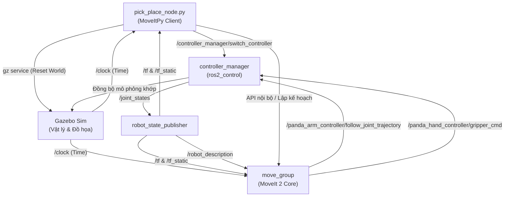

# Chi Tiết về ROS 2 trong Dự án Robot Arm Pick & Place

Tài liệu này trình bày chi tiết về kiến trúc, vai trò và hoạt động của hệ thống **ROS 2 (Jazzy Jalisco)** trong dự án cánh tay robot **Franka Emika Panda** thực hiện nhiệm vụ gắp và đặt vật thể tự động (Pick & Place).

---

## Mục lục
1. [Tổng quan Kiến trúc ROS 2 & Vai trò](#1-tổng-quan-kiến-trúc-ros-2--vai-trò)
2. [Chi tiết các Gói ROS 2 (Packages) trong Workspace](#2-chi-tiết-các-gói-ros-2-packages-trong-workspace)
3. [Chi tiết các ROS 2 Topics (Chủ đề giao tiếp)](#3-chi-tiết-các-ros-2-topics-chủ-đề-giao-tiếp)
4. [Chi tiết các ROS 2 Services (Dịch vụ yêu cầu - phản hồi)](#4-chi-tiết-các-ros-2-services-dịch-vụ-yêu-cầu---phản-hồi)
5. [Chi tiết các ROS 2 Actions (Hành động phản hồi liên tục)](#5-chi-tiết-các-ros-2-actions-hành-động-phản-hồi-liên-tục)
6. [Sơ đồ Luồng Giao tiếp Hệ thống](#6-sơ-đồ-luồng-giao-tiếp-hệ-thống)
7. [Giải thích Chi tiết Mã nguồn Node Điều khiển `pick_place_node.py`](#7-giải-thích-chi-tiết-mã-nguồn-node-điều-khiển-pick_place_nodepy)
8. [Cách thức Kiểm tra & Gỡ lỗi bằng ROS 2 CLI](#8-cách-thức-kiểm-tra--gỡ-lỗi-bằng-ros-2-cli)

---

## 1. Tổng quan Kiến trúc ROS 2 & Vai trò

Trong dự án này, **ROS 2** đóng vai trò là "hệ điều hành robot", quản lý giao tiếp giữa các thành phần phần cứng giả lập, bộ điều khiển động học (kinematics), bộ lập kế hoạch đường đi (path planning), và mã nguồn logic ứng dụng. 

Cánh tay robot **Franka Emika Panda** gồm 7 khớp xoay linh hoạt (7 DoF) và bộ kẹp 2 ngón (Hand/Gripper) được mô phỏng động lực học trong **Gazebo Sim**. ROS 2 điều phối việc:
* Đọc trạng thái khớp liên tục từ Gazebo (`joint_states`).
* Chuyển đổi khung tọa độ (TF frames) giữa các khớp để xác định vị trí thực tế của đầu gắp.
* Thực thi kế hoạch chuyển động (trajectory) từ bộ lập kế hoạch **MoveIt 2** thông qua giao tiếp Action.
* Quản lý trạng thái và thiết lập lại (reset) môi trường giả lập khi kết thúc chu kỳ.

---

## 2. Chi tiết các Gói ROS 2 (Packages) trong Workspace

Workspace chứa 5 packages chính, mỗi package đảm nhận một nhiệm vụ riêng biệt trong vòng đời phát triển:

1. **`my_robot_arm_description`**:
   * **Nhiệm vụ**: Định nghĩa mô hình hình học, cấu trúc động học và các thuộc tính vật lý (khối lượng, quán tính) của robot Panda dưới dạng file Xacro/URDF.
   * **Đặc điểm**: Tích hợp thẻ `<ros2_control>` để mô tả phần cứng và liên kết các cơ cấu chấp hành khớp với hệ thống điều khiển ROS 2, cho phép chuyển đổi linh hoạt giữa cơ cấu giả lập (`mock_components`) và mô phỏng Gazebo (`gz_ros2_control`).
2. **`my_robot_arm_control`**:
   * **Nhiệm vụ**: Cấu hình các bộ điều khiển (`ros2_controllers.yaml`) cho robot.
   * **Đặc điểm**: Khai báo và nạp hai bộ điều khiển chính: `panda_arm_controller` (kiểu `JointTrajectoryController` quản lý cánh tay 7 khớp) và `panda_hand_controller` (kiểu `GripperActionController` quản lý độ rộng ngón kẹp).
3. **`my_robot_arm_gazebo`**:
   * **Nhiệm vụ**: Thiết lập môi trường mô phỏng 3D vật lý trong Gazebo.
   * **Đặc điểm**: Chứa file thế giới ảo `pick_place_world.sdf` (gồm bàn, hộp đỏ, vùng đặt xanh) và nạp robot vào không gian mô phỏng, tích hợp plugin `gz_ros2_control/GazeboSimSystem` để tạo cầu nối điều khiển trực tiếp.
4. **`my_robot_arm_moveit_config`**:
   * **Nhiệm vụ**: Cấu hình MoveIt 2 để thực hiện giải động học ngược (IK) và tránh va chạm.
   * **Đặc điểm**: Chứa file SRDF (`panda.srdf`) phân chia nhóm khớp (`panda_arm`, `hand`), cấu hình thuật toán OMPL lập kế hoạch đường đi, và liên kết MoveIt với các Action điều khiển của `ros2_control`.
5. **`my_robot_arm_pick_place`**:
   * **Nhiệm vụ**: Chứa logic kịch bản gắp thả tự động.
   * **Đặc điểm**: Chứa node điều khiển chính `pick_place_node.py` sử dụng thư viện **MoveItPy** (API Python hiệu năng cao mới của MoveIt 2) để gọi kế hoạch chuyển động và thực thi theo chu kỳ 11 bước.

---

## 3. Chi tiết các ROS 2 Topics (Chủ đề giao tiếp)

Topic là cơ chế truyền thông điệp theo mô hình **Publish/Subscribe** (Xuất bản / Đăng ký) không đồng bộ. Dưới đây là các topic hoạt động trong dự án:

| Tên Topic | Kiểu dữ liệu | Bên xuất bản (Publisher) | Bên đăng ký (Subscriber) | Tác dụng trong dự án |
| :--- | :--- | :--- | :--- | :--- |
| `/clock` | `rosgraph_msgs/msg/Clock` | `ros_gz_bridge` (Gazebo) | Toàn bộ các Node trong hệ thống | Cung cấp thời gian mô phỏng (simulation time) thay thế cho thời gian hệ thống thực tế. Điều này rất quan trọng để đồng bộ hóa tốc độ tính toán quỹ đạo với mô phỏng vật lý của Gazebo. |
| `/joint_states` | `sensor_msgs/msg/JointState` | `joint_state_broadcaster` (ros2_control) | `robot_state_publisher`, `move_group`, `MoveItPy` | Cập nhật liên tục góc quay (vị trí), vận tốc, lực của tất cả 7 khớp xoay cánh tay và 2 ngón kẹp của robot để các node khác biết trạng thái thực tại của robot. |
| `/robot_description` | `std_msgs/msg/String` | `robot_state_publisher` | `move_group`, RViz2, `MoveItPy` | Phát nội dung XML URDF của robot dưới dạng chuỗi (String) để các node tính toán động học hiểu được cấu trúc liên kết cơ khí và giới hạn khớp. |
| `/tf` | `tf2_msgs/msg/TFMessage` | `robot_state_publisher`, Gazebo plugins | `move_group`, RViz2, `MoveItPy` | Phát tọa độ biến đổi động giữa các khung liên kết (Transform Frames). Ví dụ: vị trí từ `panda_link0` (gốc tọa độ) đến `panda_hand` (đầu gắp) để tính toán vị trí Cartesian của robot. |
| `/tf_static` | `tf2_msgs/msg/TFMessage` | `robot_state_publisher` | `move_group`, RViz2, `MoveItPy` | Phát tọa độ biến đổi tĩnh (không thay đổi trong suốt quá trình chạy) giữa các liên kết cơ học cố định trên robot để tiết kiệm băng thông. |
| `/display_planned_path` | `moveit_msgs/msg/DisplayTrajectory` | `move_group` | RViz2 | Gửi dữ liệu quỹ đạo chuyển động đã lập kế hoạch để hiển thị trước đường đi dưới dạng bóng ma/mô phỏng trên màn hình RViz2 trước khi robot thực hiện. |

---

## 4. Chi tiết các ROS 2 Services (Dịch vụ yêu cầu - phản hồi)

Service hoạt động theo mô hình **Request/Response** (Yêu cầu / Phản hồi) đồng bộ. Dưới đây là các service được gọi trong dự án:

### 4.1 `/controller_manager/switch_controller`
* **Kiểu dữ liệu**: `controller_manager_msgs/srv/SwitchController`
* **Server**: Node `controller_manager` (Được sinh ra bởi plugin Gazebo khi chạy sim, hoặc node `ros2_control_node` khi chạy mock).
* **Client**: Node `pick_place_node` (Trong hàm `reactivate_controllers`).
* **Tác dụng**: Bật/Tắt linh hoạt các bộ điều khiển. Trong dự án, khi kết thúc chu kỳ gắp đặt, hệ thống sẽ reset Gazebo. Việc reset Gazebo khiến các controller của robot chuyển sang trạng thái dừng (`inactive`). Node Python sẽ gửi một request kích hoạt lại (`activate_controllers=['joint_state_broadcaster', 'panda_arm_controller', 'panda_hand_controller']`) để robot tiếp tục chạy vòng tiếp theo.

### 4.2 Các Service của Gazebo Sim (Gọi qua Subprocess)
Do trong phiên bản ROS 2 Jazzy, cầu nối dịch vụ trực tiếp giữa Gazebo Sim và ROS 2 cho các lệnh hệ thống có thể bị giới hạn hoặc yêu cầu gói thư viện bổ sung phức tạp, dự án đã gọi trực tiếp các Service nội bộ của Gazebo thông qua lệnh hệ thống `gz service`:
1. **`/world/pick_place_world/control`**:
   * **Kiểu dữ liệu**: Yêu cầu `gz.msgs.WorldControl` / Phản hồi `gz.msgs.Boolean`.
   * **Tác dụng**: Reset trạng thái của tất cả các thực thể (mô hình) trong thế giới mô phỏng về vị trí ban đầu mà không làm khởi động lại thời gian mô phỏng (`reset: {model_only: true}`).
2. **`/world/pick_place_world/set_pose`**:
   * **Kiểu dữ liệu**: Yêu cầu `gz.msgs.Pose` / Phản hồi `gz.msgs.Boolean`.
   * **Tác dụng**: Reset chính xác vị trí của khối lập phương màu đỏ (`pick_object`) về tọa độ xuất phát trên bàn (`x: 0.5, y: 0.0, z: 0.445`) để robot có thể thực hiện chu kỳ gắp tiếp theo.

---

## 5. Chi tiết các ROS 2 Actions (Hành động phản hồi liên tục)

Action được thiết kế cho các tác vụ tốn thời gian, hoạt động theo cơ chế **Goal/Feedback/Result** (Mục tiêu / Phản hồi tiến độ / Kết quả cuối). Đây là giao thức truyền thông điệp cốt lõi mà MoveIt dùng để điều khiển chuyển động của cánh tay và ngón kẹp.

### 5.1 `/panda_arm_controller/follow_joint_trajectory`
* **Kiểu dữ liệu**: `control_msgs/action/FollowJointTrajectory`
* **Action Server**: Bộ điều khiển cánh tay `panda_arm_controller` (được chạy bởi `ros2_control`).
* **Action Client**: Bộ lập kế hoạch MoveIt 2 (`move_group` hoặc `MoveItPy`).
* **Tác dụng**: 
  1. MoveIt tính toán một chuỗi các điểm quỹ đạo (trajectory points) gồm góc khớp, vận tốc, gia tốc và thời gian tương ứng.
  2. Gửi chuỗi này làm Goal tới Action Server.
  3. Action Server điều khiển động cơ khớp bám theo quỹ đạo này và gửi Feedback về sai số vị trí hiện tại.
  4. Khi cánh tay đạt tới đích trong khoảng sai số cho phép (`goal_tolerance` định nghĩa trong `ros2_controllers.yaml`), Action Server gửi thông báo thành công (Result).

### 5.2 `/panda_hand_controller/gripper_cmd`
* **Kiểu dữ liệu**: `control_msgs/action/GripperCommand`
* **Action Server**: Bộ điều khiển ngón kẹp `panda_hand_controller`.
* **Action Client**: Bộ lập kế hoạch MoveIt 2.
* **Tác dụng**:
  1. MoveIt gửi Goal yêu cầu mở ngón kẹp tới vị trí đích (ví dụ: `0.035 m` mỗi ngón khi mở, hoặc `0.018 m` khi đóng kẹp vật) cùng với lực kẹp tối đa mong muốn (`gripper_effort`).
  2. Bộ kẹp di chuyển các ngón kẹp song song bám theo khoảng cách này.
  3. Trả về kết quả thành công khi khoảng cách ngón kẹp đạt yêu cầu hoặc lực kẹp chạm ngưỡng chặn hành trình.

---

## 6. Sơ đồ Luồng Giao tiếp Hệ thống

Sơ đồ dưới đây biểu diễn sự tương tác của các node ROS 2 thông qua Topics, Services và Actions:



---

## 7. Giải thích Chi tiết Mã nguồn Node Điều khiển `pick_place_node.py`

Dưới đây là phân tích chi tiết từng phần code của [pick_place_node.py](file:///home/ddd/arm_robot/src/my_robot_arm_pick_place/my_robot_arm_pick_place/pick_place_node.py):

### 7.1 Thư viện Nhập vào (Imports)
```python
import time
import rclpy
from rclpy.node import Node
from rclpy.parameter import Parameter
from geometry_msgs.msg import Pose, PoseStamped
from moveit.core.robot_state import RobotState
from moveit.planning import MoveItPy, PlanningComponent
import numpy as np
```
* `rclpy`: Thư viện Client API Python chính thức của ROS 2.
* `Pose, PoseStamped`: Các cấu trúc dữ liệu hình học tiêu chuẩn của ROS để biểu diễn vị trí (x, y, z) và hướng (quaternion x, y, z, w) của robot hoặc vật thể.
* `MoveItPy, PlanningComponent`: Thư viện Python bindings của MoveIt 2, cho phép lập kế hoạch và điều khiển robot trực tiếp từ mã Python mà không cần gọi qua dịch vụ C++ `move_group` truyền thống, giúp tăng tốc độ phản hồi và dễ lập trình.

### 7.2 Phương thức Khởi tạo `__init__`
```python
class PickPlaceNode(Node):
    def __init__(self):
        super().__init__('pick_place_node')
```
* Kế thừa từ lớp `Node` của `rclpy` và khởi tạo node với tên là `'pick_place_node'`.

#### Khai báo Tham số (Parameters)
```python
        self.declare_parameter('approach_height', 0.12)
        self.declare_parameter('retreat_height', 0.20)
        # ...
        self.declare_parameter('pick_position.x', 0.5)
        # ...
        self.declare_parameter('arm_group_name', 'panda_arm')
        self.declare_parameter('gripper_group_name', 'hand')
```
* Khai báo các tham số ROS 2 với giá trị mặc định. Các tham số này có thể dễ dàng bị ghi đè thông qua file cấu hình YAML (`pick_place_params.yaml`) mà không cần thay đổi hay biên dịch lại code Python.

#### Khởi tạo Cấu hình MoveItPy Động
```python
        # Determine hardware type based on simulation configuration
        use_sim_time = self.get_parameter('use_sim_time').value
        hardware_type = 'gz_ros2_control' if use_sim_time else 'mock_components'
        
        # Find absolute path of URDF xacro
        urdf_path = os.path.join(
            get_package_share_directory('my_robot_arm_description'),
            'urdf',
            'my_robot_arm.urdf.xacro'
        )
```
* Node kiểm tra tham số `use_sim_time` để xác định đang chạy trên giả lập ảo (`mock_components`) hay môi trường Gazebo thực tế (`gz_ros2_control`). Nó cũng tự động tìm đường dẫn tuyệt đối của file Xacro mô tả robot để dựng mô hình động học MoveIt.

```python
        # Build MoveIt parameters dictionary (using only OMPL pipeline)
        moveit_config = (
            MoveItConfigsBuilder("panda", package_name="my_robot_arm_moveit_config")
            .robot_description(file_path=urdf_path, mappings={"ros2_control_hardware_type": hardware_type})
            .moveit_cpp(file_path="config/moveit_cpp.yaml")
            .planning_pipelines(pipelines=["ompl"])
            .to_moveit_configs()
        )
```
* Sử dụng `MoveItConfigsBuilder` để tự động xây dựng một cuốn từ điển cấu hình đầy đủ bao gồm: robot_description (URDF), robot_description_semantic (SRDF), kinematics solver, cấu hình lập kế hoạch OMPL và các controller tương ứng. Đây là cơ chế cấu hình hợp nhất của MoveIt 2.

#### Override cấu hình QOS của `/clock` khi chạy Sim
```python
        # Add use_sim_time and qos_overrides to MoveItPy C++ config if simulation is enabled
        config_dict = moveit_config.to_dict()
        if use_sim_time:
            config_dict['use_sim_time'] = True
            config_dict['qos_overrides./clock.subscription.durability'] = 'volatile'
            config_dict['qos_overrides./clock.subscription.reliability'] = 'best_effort'
            config_dict['qos_overrides./clock.subscription.depth'] = 1
            config_dict['qos_overrides./clock.subscription.history'] = 'keep_last'
```
* **Rất quan trọng**: Gazebo phát dữ liệu thời gian lên topic `/clock` bằng chất lượng dịch vụ (QoS) `best_effort` và `volatile`. Nếu MoveItPy đăng ký lắng nghe `/clock` theo chế độ mặc định (`reliable`/`transient_local`), nó sẽ không nhận được dữ liệu thời gian, khiến toàn bộ tiến trình lập kế hoạch bị đơ hoặc lỗi timeout. Khối lệnh này điều chỉnh cấu hình QoS cho MoveItPy trùng khớp với Gazebo.

#### Khởi tạo thực thể MoveItPy & Chạy Thread riêng
```python
        # Instantiate MoveItPy with built config
        self.moveit = MoveItPy(
            node_name='pick_place_moveit_py',
            config_dict=config_dict
        )
        self.arm = self.moveit.get_planning_component(self.arm_group)
        self.gripper = self.moveit.get_planning_component(self.gripper_group)
        # ...
        import threading
        self.thread = threading.Thread(target=self.run_pick_and_place, daemon=True)
        self.thread.start()
```
* Khởi tạo đối tượng `MoveItPy` với cấu hình vừa dựng.
* Lấy ra các Planning Component cho cánh tay (`panda_arm`) và bộ kẹp (`hand`).
* **Tại sao cần Thread riêng?** Vòng lặp Pick & Place là một chuỗi hành động đồng bộ kéo dài nhiều giây (gồm các hàm `sleep`, chờ robot chuyển động). Nếu chạy vòng lặp này trực tiếp trong luồng chính của ROS 2, nó sẽ chặn không cho hàm `rclpy.spin(node)` xử lý các sự kiện phản hồi từ các topic khác. Do đó, logic gắp thả được chạy độc lập trên một luồng phụ (Thread).

---

### 7.3 Các Hàm Trợ giúp Di chuyển (Motion Helpers)

#### Di chuyển theo Trạng thái Đặt tên trước (Named States)
```python
    def move_arm_to_named_state(self, state_name: str) -> bool:
        self.get_logger().info(f'Moving arm to named state: {state_name}')
        for attempt in range(3):
            self.arm.set_start_state_to_current_state()
            self.arm.set_goal_state(configuration_name=state_name)
            plan_result = self.arm.plan()
            if plan_result:
                robot_trajectory = plan_result.trajectory
                self.get_logger().info(f'Plan succeeded for {state_name}. Executing...')
                self.moveit.execute(robot_trajectory, controllers=["panda_arm_controller"])
                time.sleep(1.0)
                return True
            time.sleep(0.5)
        return False
```
* **Hàm này**: Di chuyển robot tới các trạng thái định nghĩa sẵn trong SRDF (ví dụ: tư thế chuẩn bị `'ready'`).
* **Cơ chế**:
  1. `set_start_state_to_current_state()`: Đồng bộ trạng thái bắt đầu lập kế hoạch với tư thế khớp thực tại của robot.
  2. `set_goal_state(configuration_name=state_name)`: Thiết lập đích đến bằng tên trạng thái.
  3. `plan()`: Gọi OMPL tính toán quỹ đạo tránh va chạm.
  4. `execute(...)`: Gửi quỹ đạo thành công tới Action Server của controller tương ứng (`panda_arm_controller`) để chuyển động cánh tay robot thực tế.

#### Di chuyển theo Tọa độ Không gian (Cartesian Pose)
```python
    def move_arm_to_pose(self, x: float, y: float, z: float,
                         ox: float, oy: float, oz: float, ow: float,
                         label: str = 'target') -> bool:
        pose_goal = PoseStamped()
        pose_goal.header.frame_id = 'panda_link0'
        pose_goal.pose.position.x = x
        pose_goal.pose.position.y = y
        pose_goal.pose.position.z = z
        pose_goal.pose.orientation.x = ox
        pose_goal.pose.orientation.y = oy
        pose_goal.pose.orientation.z = oz
        pose_goal.pose.orientation.w = ow

        for attempt in range(3):
            self.arm.set_start_state_to_current_state()
            self.arm.set_goal_state(pose_stamped_msg=pose_goal, pose_link='panda_link8')
            plan_result = self.arm.plan()
            if plan_result:
                self.moveit.execute(plan_result.trajectory, controllers=["panda_arm_controller"])
                time.sleep(1.0)
                return True
            time.sleep(0.5)
        return False
```
* **Hàm này**: Điều khiển đầu gắp robot (`panda_link8`) tới một điểm đích có tọa độ 3D xác định trong không gian.
* **Cơ chế**: Dựng đối tượng `PoseStamped` quy chiếu về gốc cơ sở của robot `panda_link0`. Đặt giá trị góc quay đầu gắp bằng Quaternion (hướng đầu gắp chúc thẳng xuống dưới để gắp). MoveIt sẽ tự động tính toán Động học ngược (IK) để tìm ra góc của 7 khớp phù hợp giúp đầu gắp chạm tới tọa độ yêu cầu.

#### Điều khiển Bộ kẹp (Gripper Control)
```python
    def set_gripper(self, state_name: str) -> bool:
        self.get_logger().info(f'Setting gripper to: {state_name}')
        for attempt in range(3):
            self.gripper.set_start_state_to_current_state()
            self.gripper.set_goal_state(configuration_name=state_name)
            plan_result = self.gripper.plan()
            if plan_result:
                self.moveit.execute(plan_result.trajectory, controllers=["panda_hand_controller"])
                time.sleep(1.5)
                return True
            time.sleep(0.5)
        return False
```
* Tương tự di chuyển cánh tay, nhưng đích đến là các trạng thái khớp của ngón kẹp (`open` hoặc `close`) và thực thi qua bộ điều khiển `panda_hand_controller`.

---

### 7.4 Reset Môi trường & Khởi động lại Controllers (Dùng cho Gazebo Sim)

#### Reset Gazebo qua câu lệnh dòng lệnh
```python
    def reset_world(self):
        self.get_logger().info('Calling Gazebo Reset World (model_only)...')
        import subprocess
        try:
            cmd = [
                "gz", "service", "-s", "/world/pick_place_world/control",
                "--reqtype", "gz.msgs.WorldControl",
                "--reptype", "gz.msgs.Boolean",
                "--timeout", "3000",
                "--req", "reset: {model_only: true}"
            ]
            subprocess.run(cmd, stdout=subprocess.DEVNULL, stderr=subprocess.DEVNULL)
        except Exception as e:
            self.get_logger().error(f'Failed to call Reset World: {e}')

        # Đưa vật thể đỏ về vị trí bàn ban đầu
        try:
            cmd = [
                "gz", "service", "-s", "/world/pick_place_world/set_pose",
                "--reqtype", "gz.msgs.Pose",
                "--reptype", "gz.msgs.Boolean",
                "--timeout", "3000",
                "--req", f'name: "pick_object", position: {{x: {self.pick_x}, y: {self.pick_y}, z: {self.pick_z}}}, orientation: {{x: 0.0, y: 0.0, z: 0.0, w: 1.0}}'
            ]
            subprocess.run(cmd, stdout=subprocess.DEVNULL, stderr=subprocess.DEVNULL)
        except Exception as e:
            self.get_logger().error(f'Failed to reset pick_object pose: {e}')
```
* Khi chạy trong Gazebo Sim, sau khi hoàn thành một lượt gắp-thả hộp đỏ từ vị trí A sang vị trí B, ta cần đưa hộp đỏ quay lại vị trí A để chạy tiếp chu kỳ mới.
* Hàm này sử dụng thư viện `subprocess` để gọi trực tiếp các tiện ích dịch vụ của Gazebo (`gz service`), gửi lệnh reset trạng thái mô hình về ban đầu.

#### Kích hoạt lại Controllers của ROS 2 sau khi Reset
```python
    def reactivate_controllers(self):
        self.get_logger().info('Reactivating controllers...')
        from controller_manager_msgs.srv import SwitchController
        
        client = self.create_client(SwitchController, '/controller_manager/switch_controller')
        while not client.wait_for_service(timeout_sec=1.0):
            if not rclpy.ok():
                return
            self.get_logger().info('Waiting for /controller_manager/switch_controller service...')
            
        req = SwitchController.Request()
        req.activate_controllers = ['joint_state_broadcaster', 'panda_arm_controller', 'panda_hand_controller']
        req.strictness = SwitchController.Request.BEST_EFFORT
        req.activate_asap = True
        
        future = client.call_async(req)
        # Chờ đồng bộ kết quả trả về từ service
```
* **Tại sao cần hàm này?** Khi gửi lệnh reset mô hình tới Gazebo, Gazebo Sim sẽ xóa đi các thực thể cũ và tạo lại. Tiến trình này khiến plugin điều khiển khớp `gz_ros2_control` khởi động lại phần cứng ảo, chuyển trạng thái các bộ điều khiển sang `inactive`.
* Hàm tạo một **Service Client** ROS 2 kết nối đến dịch vụ `/controller_manager/switch_controller` để gửi yêu cầu kích hoạt lại danh sách bộ điều khiển nhằm sẵn sàng nhận lệnh tiếp theo.

---

### 7.5 Vòng lặp Tuần tự 11 Bước Gắp Đặt (`execute_sequence`)
Hàm `execute_sequence()` chứa thuật toán di chuyển an toàn giúp robot thực hiện trọn vẹn chu trình gắp thả:

```python
    def execute_sequence(self) -> bool:
        # [Bước 1] Di chuyển cánh tay về Ready Pose
        self.move_arm_to_named_state('ready')

        # [Bước 2] Mở rộng bộ kẹp
        self.set_gripper('open')

        # [Bước 3] Di chuyển đến điểm tiếp cận phía trên vật thể (Pre-grasp)
        pre_pick_z = self.pick_z + self.approach_h
        self.move_arm_to_pose(self.pick_x, self.pick_y, pre_pick_z, ..., label='pre-grasp')

        # [Bước 4] Hạ đầu gắp xuống đúng vị trí hộp đỏ (Grasp Pose)
        self.move_arm_to_pose(self.pick_x, self.pick_y, self.pick_z, ..., label='grasp')

        # [Bước 5] Đóng bộ kẹp để ôm chặt vật
        self.set_gripper('close')

        # [Bước 6] Nhấc vật thẳng đứng hướng lên trên (Post-grasp Retreat)
        post_pick_z = self.pick_z + self.retreat_h
        self.move_arm_to_pose(self.pick_x, self.pick_y, post_pick_z, ..., label='post-grasp retreat')

        # [Bước 7] Di chuyển ngang đến vị trí trên điểm đặt đích (Pre-place)
        pre_place_z = self.place_z + self.place_approach_h
        self.move_arm_to_pose(self.place_x, self.place_y, pre_place_z, ..., label='pre-place')

        # [Bước 8] Hạ vật xuống mặt bàn đích (Place Pose)
        self.move_arm_to_pose(self.place_x, self.place_y, self.place_z, ..., label='place')

        # [Bước 9] Mở bộ kẹp giải phóng khối hộp
        self.set_gripper('open')

        # [Bước 10] Nhấc cánh tay lên cao tránh va quẹt vật sau khi đặt
        post_place_z = self.place_z + self.retreat_h
        self.move_arm_to_pose(self.place_x, self.place_y, post_place_z, ..., label='post-place retreat')

        # [Bước 11] Quay trở lại vị trí Ready chuẩn bị cho lượt mới
        self.move_arm_to_named_state('ready')
        return True
```

---

## 8. Cách thức Kiểm tra & Gỡ lỗi bằng ROS 2 CLI

Khi hệ thống đang hoạt động, bạn có thể mở các Terminal mới để kiểm tra luồng truyền nhận thông điệp của ROS 2:

### 8.1 Kiểm tra các Node đang chạy
```bash
ros2 node list
```
*Kết quả mong đợi:*
```
/robot_state_publisher
/move_group
/pick_place_node
/controller_manager
```

### 8.2 Xem danh sách các Topic đang hoạt động
```bash
ros2 topic list
```
*Kết quả mong đợi:* Bạn sẽ thấy `/clock`, `/joint_states`, `/robot_description`, `/tf`, `/tf_static`, và các topic phản hồi vị trí khớp khác.

### 8.3 Kiểm tra tần số xuất bản trạng thái khớp (Joint States)
```bash
ros2 topic hz /joint_states
```
*Kết quả mong đợi:* Tần số cập nhật khoảng ~500 Hz (được cấu hình trong `ros2_controllers.yaml` bằng thông số `update_rate: 500`).

### 8.4 Kiểm tra trạng thái các Controller của Robot
```bash
ros2 control list_controllers
```
*Kết quả mong đợi:*
```
joint_state_broadcaster[joint_state_broadcaster/JointStateBroadcaster] active
panda_arm_controller[joint_trajectory_controller/JointTrajectoryController] active
panda_hand_controller[position_controllers/GripperActionController] active
```
Nếu có controller nào ở trạng thái `inactive`, robot sẽ không thể di chuyển hoặc gắp được.

### 8.5 Kiểm tra danh sách Action đang sẵn sàng
```bash
ros2 action list
```
*Kết quả mong đợi:*
```
/panda_arm_controller/follow_joint_trajectory
/panda_hand_controller/gripper_cmd
```
