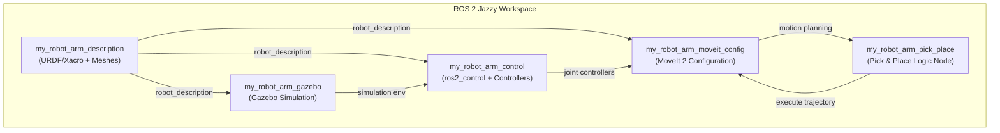

# Báo cáo Dự án: Robot Arm Pick & Place (ROS 2 Jazzy)

Báo cáo này trình bày chi tiết về dự án phát triển hệ thống **Robot Arm Pick & Place** (Gắp và Đặt vật thể tự động) sử dụng mô hình robot **Franka Emika Panda** trên nền tảng **ROS 2 Jazzy** và mô phỏng **Gazebo Sim**.

---

## 1. Yêu cầu & Mục tiêu Dự án

- **Yêu cầu:** Phát triển một hệ thống điều khiển cánh tay robot thực hiện nhiệm vụ nhận diện/lấy thông tin vị trí của vật thể từ trước, tự động tiếp cận, gắp vật thể từ vị trí A và đặt vào một vị trí B bất kỳ đã biết trước tọa độ.
- **Robot lựa chọn:** Franka Emika Panda (7 khớp xoay + 1 bộ kẹp gripper song song 2 ngón).
- **Môi trường mô phỏng:** Gazebo Sim với bàn gỗ, vật thể đích (hộp màu đỏ) và khu vực đặt đích (vùng màu xanh).

---

## 2. Kiến trúc Hệ thống & Gói ROS 2

Dự án được phân chia thành **5 packages** chuyên biệt để quản lý mã nguồn, cấu hình và tài nguyên:



### Chi tiết các Package:

1. **[my_robot_arm_description](file:///home/ddd/ros2_ws/src/my_robot_arm_description):**
   - Chứa các file mô tả robot bằng định dạng URDF/Xacro, tích hợp các cơ cấu chấp hành `ros2_control`.
   - Sử dụng các file lưới (meshes) 3D của robot Panda từ package `moveit_resources_panda_description` của hệ thống.
2. **[my_robot_arm_control](file:///home/ddd/ros2_ws/src/my_robot_arm_control):**
   - Cấu hình controller cho các khớp xoay (`JointTrajectoryController`) và cho ngón kẹp (`GripperActionController`).
   - Cung cấp launch file để chạy controller manager cùng với việc nạp (spawn) các controller theo đúng thứ tự.
3. **[my_robot_arm_gazebo](file:///home/ddd/ros2_ws/src/my_robot_arm_gazebo):**
   - Thiết lập môi trường thế giới ảo Gazebo (`pick_place_world.sdf`) gồm sàn, bàn gỗ, vật gắp màu đỏ ($0.04 \times 0.04 \times 0.04$ m) và vùng đặt màu xanh lá.
   - Nạp robot vào Gazebo sử dụng plugin `gz_ros2_control` để đồng bộ trạng thái mô phỏng.
4. **[my_robot_arm_moveit_config](file:///home/ddd/ros2_ws/src/my_robot_arm_moveit_config):**
   - Chứa cấu hình MoveIt 2 gồm file SRDF định nghĩa các nhóm lập kế hoạch (`panda_arm`, `hand`, `panda_arm_hand`).
   - Cấu hình bộ giải động học ngược (IK Solver) sử dụng plugin KDL.
5. **[my_robot_arm_pick_place](file:///home/ddd/ros2_ws/src/my_robot_arm_pick_place):**
   - Node Python chính (`pick_place_node.py`) sử dụng thư viện API Python của MoveIt 2 để thực hiện chuỗi hành động gắp thả.
   - File cấu hình YAML (`pick_place_params.yaml`) lưu trữ tọa độ của vị trí Pick và vị trí Place.

---

## 3. Cấu trúc Thư mục Nguồn cụ thể

Dưới đây là sơ đồ chi tiết các tệp quan trọng trong thư mục `/home/ddd/ros2_ws/src`:

```
src/
├── my_robot_arm_description/
│   ├── urdf/
│   │   ├── my_robot_arm.urdf.xacro          # File Xacro chính nạp mô hình Panda
│   │   ├── panda_arm.ros2_control.xacro     # Định nghĩa phần cứng ros2_control của cánh tay
│   │   └── panda_hand.ros2_control.xacro    # Định nghĩa phần cứng ros2_control của gripper
│   ├── config/
│   │   └── initial_positions.yaml           # Tư thế ban đầu của robot khi khởi chạy
│   ├── launch/
│   │   └── display.launch.py                # Hiển thị robot trong RViz2 độc lập
│   └── rviz/
│       └── display.rviz                     # Cấu hình giao diện RViz2 cơ bản
│
├── my_robot_arm_control/
│   ├── config/
│   │   └── ros2_controllers.yaml            # Khai báo các loại controller và khớp tương ứng
│   └── launch/
│       └── robot_control.launch.py          # Launch khởi chạy controller manager độc lập
│
├── my_robot_arm_gazebo/
│   ├── worlds/
│   │   └── pick_place_world.sdf             # Thiết kế bàn gỗ + vật đỏ + khu vực đích xanh
│   └── launch/
│       └── gazebo.launch.py                 # Launch mở Gazebo + Spawners
│
├── my_robot_arm_moveit_config/
│   ├── config/
│   │   ├── panda.srdf                       # Định nghĩa nhóm khớp, tư thế sẵn có, khử va chạm
│   │   ├── kinematics.yaml                  # Tham số IK Solver (KDL)
│   │   └── moveit_controllers.yaml          # Liên kết MoveIt với ros2_control actions
│   └── launch/
│       └── moveit.launch.py                 # Chạy move_group và giao diện RViz điều khiển bằng tay
│
└── my_robot_arm_pick_place/
    ├── my_robot_arm_pick_place/
    │   └── pick_place_node.py               # Node Python thực thi tự động 11 bước gắp đặt
    ├── config/
    │   └── pick_place_params.yaml           # Các tham số tọa độ x, y, z và cấu hình khoảng cách gắp
    └── launch/
        └── pick_place.launch.py             # File khởi chạy toàn bộ hệ thống tích hợp
```

---

## 4. Quy trình Tự động Hóa Pick & Place (11 Bước)

Thuật toán điều khiển của Node `pick_place_node` hoạt động theo một quy trình tuần tự khép kín để đảm bảo tính an toàn tránh va chạm:

```
[ Bước 1 ]  Di chuyển cánh tay về vị trí sẵn sàng chuẩn (Ready Pose / Home)
    │
[ Bước 2 ]  Mở ngón kẹp (Gripper) ra độ rộng tối đa (3.5 cm mỗi ngón)
    │
[ Bước 3 ]  Di chuyển đầu gắp đến điểm tiếp cận Pick (Pre-grasp - phía trên vật thể +12 cm)
    │
[ Bước 4 ]  Hạ đầu gắp xuống theo trục đứng đến tọa độ gắp vật (Grasp Pose)
    │
[ Bước 5 ]  Đóng ngón kẹp để giữ chặt khối lập phương (Grip Object)
    │
[ Bước 6 ]  Nhấc vật lên theo phương thẳng đứng (Post-grasp Retreat - lên cao +20 cm)
    │
[ Bước 7 ]  Di chuyển cánh tay đến điểm tiếp cận vị trí đặt (Pre-place - trên vị trí đặt +15 cm)
    │
[ Bước 8 ]  Hạ cánh tay xuống điểm đặt vật đích (Place Pose)
    │
[ Bước 9 ]  Mở ngón kẹp để thả vật ra (Release Object)
    │
[ Bước 10] Nhấc đầu gắp lên cao cách xa vật thể sau khi đặt (Post-place Retreat - lên cao +20 cm)
    │
[ Bước 11] Quay trở lại vị trí sẵn sàng chuẩn (Ready Pose / Home) để kết thúc chu kỳ
```

---

## 5. Hướng dẫn Khởi chạy & Kiểm tra

Đảm bảo bạn luôn thực hiện nạp môi trường ROS 2 ở mỗi Terminal mới trước khi chạy:
```bash
source /opt/ros/jazzy/setup.bash
source ~/ros2_ws/install/setup.bash
```

### A. Kiểm tra mô hình hình học robot (Giai đoạn 1)
Để kiểm tra xem mô hình robot và hệ thống khung liên kết (TF) có chính xác không:
```bash
ros2 launch my_robot_arm_description display.launch.py
```
*Kết quả:* RViz2 sẽ mở ra hiển thị robot Panda 3D và một bảng điều khiển thanh trượt cho phép bạn xoay thử các khớp.

### B. Chạy mô phỏng thế giới ảo (Giai đoạn 3)
Để khởi tạo môi trường Gazebo chứa robot, bàn gỗ và vật thể:
```bash
ros2 launch my_robot_arm_gazebo gazebo.launch.py
```
*Kết quả:* Gazebo Sim mở ra, bạn sẽ thấy robot Panda đứng trước bàn gỗ có đặt một hộp màu đỏ.

### C. Chạy toàn bộ chương trình gắp thả tự động (Tích hợp Giai đoạn 5)
Bạn có **2 lựa chọn/chế độ chạy**:

#### Cách 1: Chạy độc lập trong chế độ giả lập (Mock Hardware - KHÔNG cần chạy Gazebo)
Lệnh này tự khởi động một Controller Manager ảo nội bộ và thực hiện mô phỏng toán học chuyển động của robot (tự phản hồi trạng thái ảo):
```bash
ros2 launch my_robot_arm_pick_place pick_place.launch.py
```
*(Với cách này, bạn **có thể đóng Gazebo (Terminal B) hoàn toàn** trước khi chạy lệnh này. Hệ thống sẽ tự hoạt động khép kín).*

#### Cách 2: Chạy trực tiếp trên môi trường mô phỏng Gazebo (Yêu cầu MỞ CẢ HAI cùng lúc)
Nếu bạn muốn nhìn thấy robot Panda **di chuyển trực quan và gắp khối hộp màu đỏ** trong màn hình Gazebo Sim:
1. **Terminal 1:** Giữ nguyên Gazebo đang chạy (Lệnh ở **mục B** trên):
   ```bash
   ros2 launch my_robot_arm_gazebo gazebo.launch.py
   ```
2. **Terminal 2:** Mở một terminal mới, source workspace và chạy file launch chuyên dụng cho Gazebo:
   ```bash
   ros2 launch my_robot_arm_pick_place pick_place_gazebo.launch.py
   ```
*Kết quả:* Cánh tay robot trong Gazebo sẽ lập kế hoạch quỹ đạo và chuyển động gắp/đặt khối hộp đỏ trực tiếp trên màn hình mô phỏng.

---

## 6. Cấu hình & Tùy chỉnh tham số

Để thay đổi tọa độ điểm gắp hoặc điểm đặt, bạn chỉ cần chỉnh sửa các thông số trong tệp cấu hình:
- **Đường dẫn tệp:** `src/my_robot_arm_pick_place/config/pick_place_params.yaml`

```yaml
pick_place_node:
  ros__parameters:
    approach_height: 0.12         # Chiều cao tiếp cận trước khi gắp
    retreat_height: 0.20          # Chiều cao nhấc vật lên sau khi gắp
    
    pick_position:
      x: 0.5                      # Tọa độ X của hộp đỏ
      y: 0.0                      # Tọa độ Y của hộp đỏ
      z: 0.455                    # Chiều cao bề mặt bàn đặt vật
      
    place_position:
      x: 0.5                      # Tọa độ X của điểm đặt đích
      y: 0.3                      # Tọa độ Y của điểm đặt đích
      z: 0.455                    # Chiều cao bề mặt bàn đích
```

*Lưu ý:* Sau khi sửa đổi cấu hình YAML này, cần build lại gói để cập nhật vào hệ thống:
```bash
colcon build --packages-select my_robot_arm_pick_place
```

---

## 7. Cơ sở lý thuyết cốt lõi của hệ thống Robot Arm

Để làm chủ và phát triển các ứng dụng nâng cao cho cánh tay robot (như gắp thả tự động), chúng ta cần nắm vững các nền tảng lý thuyết toán học và cơ học điều khiển robot sau đây, kết hợp trực quan với các tệp cấu hình trong dự án:

### A. Động học Robot (Robot Kinematics)
Động học là môn học nghiên cứu chuyển động của robot mà không xét đến lực gây ra chuyển động đó. Đối với một cánh tay robot 7 bậc tự do (7-DOF) như Franka Emika Panda, động học chia làm hai bài toán chính:

1. **Động học thuận (Forward Kinematics - FK):**
   - *Khái niệm:* Xác định vị trí và hướng (Pose) của khâu chấp hành cuối (End-effector / Gripper) trong hệ tọa độ Descartes (gốc tại base của robot) dựa trên các góc quay hiện tại của các khớp ($\theta_1, \theta_2, ..., \theta_n$).
   - *Biểu diễn:* Sử dụng quy ước **Denavit-Hartenberg (D-H)** để gán các hệ trục tọa độ cục bộ lên từng khâu và khớp, từ đó tính toán ma trận biến đổi thuần nhất tổng hợp $T^0_n = A_1 A_2 ... A_n$.
   - 📍 **Nơi áp dụng trong dự án:** Mô hình cấu trúc hình học khớp được liên kết và thiết lập trong tệp URDF chính [my_robot_arm.urdf.xacro](file:///home/ddd/ros2_ws/src/my_robot_arm_description/urdf/my_robot_arm.urdf.xacro#L8-L10) (bằng việc `include` mô tả robot Panda từ gói hệ thống).

2. **Động học ngược (Inverse Kinematics - IK):**
   - *Khái niệm:* Tìm các góc khớp ($\theta_1, \theta_2, ..., \theta_n$) cần thiết để đưa đầu gắp robot đạt đến một Pose mong muốn $(x, y, z, roll, pitch, yaw)$ trong không gian Descartes.
   - *Độ phức tạp:* Đây là bài toán phi tuyến tính phức tạp. Một Pose có thể có vô số nghiệm khớp (nghiệm dư thừa bậc tự do) hoặc không có nghiệm nào (ngoài tầm với). Bài toán IK có hai hướng giải quyết chính:
     - *Giải pháp giải tích (Analytical/Closed-form):* Tìm nghiệm chính xác bằng toán học (nhanh, nhưng chỉ áp dụng được cho cấu trúc hình học đặc biệt của robot).
     - *Giải pháp số (Numerical):* Sử dụng các thuật toán tối ưu hóa lặp (như Newton-Raphson dựa trên ma trận nghịch đảo Jacobian). Đây là phương pháp mà bộ giải **KDL** sử dụng, đảm bảo tính vạn năng cho mọi cấu trúc khớp nhưng đòi hỏi tài nguyên tính toán và có thể rơi vào điểm cực trị cục bộ.
   - 📍 **Nơi áp dụng trong dự án:**
     - Tệp [kinematics.yaml](file:///home/ddd/ros2_ws/src/my_robot_arm_moveit_config/config/kinematics.yaml#L1-L5) khai báo việc sử dụng plugin giải động học ngược số `kdl_kinematics_plugin/KDLKinematicsPlugin` cho nhóm khớp của cánh tay robot.
     - Node lập kế hoạch [pick_place_node.py](file:///home/ddd/ros2_ws/src/my_robot_arm_pick_place/my_robot_arm_pick_place/pick_place_node.py#L164-L190) gọi hàm `self.arm.set_goal_state(pose_stamped_msg=pose_goal, pose_link='panda_link8')` để gián tiếp ra lệnh cho MoveIt giải động học ngược từ tọa độ đích để tạo tư thế khớp cho robot.

3. **Ma trận Jacobian & Vùng suy biến (Jacobian Matrix & Singularities):**
   - *Ma trận Jacobian ($J$):* Biểu diễn mối quan hệ tuyến tính giữa vận tốc khớp ($\dot{q}$) và vận tốc của khâu chấp hành cuối trong không gian Descartes ($v$): $v = J(q)\dot{q}$.
   - *Điểm suy biến (Singularity):* Là trạng thái cấu hình khớp mà tại đó định thức của ma trận Jacobian bằng 0 ($det(J) = 0$). Tại điểm suy biến, robot bị mất một hoặc nhiều bậc tự do chuyển động trong không gian Descartes, và việc giải động học ngược số học sẽ tạo ra vận tốc khớp cực đại tiến tới vô hạn, gây nguy hiểm cho hệ thống cơ khí. Bộ lập kế hoạch chuyển động cần tính toán để né tránh các cấu hình suy biến này.
   - 📍 **Nơi áp dụng trong dự án:** Được quản lý tự động bởi MoveIt thông qua thuật toán kiểm tra động học số trong tệp C++ lõi khi node [pick_place_node.py](file:///home/ddd/ros2_ws/src/my_robot_arm_pick_place/my_robot_arm_pick_place/pick_place_node.py#L182-L186) yêu cầu lập kế hoạch chuyển động bằng hàm `self.arm.plan()`. Nếu điểm nằm trong vùng suy biến, quá trình lập kế hoạch sẽ thất bại và node sẽ ghi nhận lỗi qua logger.

### B. Không gian cấu hình & Lập kế hoạch quỹ đạo (Motion Planning & Configuration Space)
1. **Không gian cấu hình (Configuration Space - C-Space):**
   - Là không gian mô tả tất cả các trạng thái tư thế có thể có của robot. Đối với robot $n$ khớp xoay độc lập, C-Space là một không gian $n$ chiều ($R^n$). 
   - Một điểm trong C-Space đại diện cho một bộ góc khớp cụ thể. C-Space được chia làm hai vùng: $C_{free}$ (vùng robot tự do di chuyển) và $C_{obstacle}$ (vùng robot va chạm với chính nó hoặc với môi trường xung quanh).
   - 📍 **Nơi áp dụng trong dự án:** Định nghĩa các nhóm khớp đại diện cho các chiều trong C-Space (cánh tay `panda_arm` với 7 chiều khớp, bàn kẹp `hand` với 2 chiều khớp) được cấu hình rõ ràng trong tệp [panda.srdf](file:///home/ddd/ros2_ws/src/my_robot_arm_moveit_config/config/panda.srdf#L15-L39).

2. **Lập kế hoạch chuyển động dựa trên lấy mẫu (Sampling-based Motion Planning):**
   - Với robot có số bậc tự do lớn (như Panda là 7-DOF), việc tính toán tường minh hình học của vùng cản trong không gian 7 chiều là bất khả thi. Do đó, các thuật toán lấy mẫu ngẫu nhiên như **RRT (Rapidly-exploring Random Trees)** và **RRT-Connect** được sử dụng.
   - *Nguyên lý RRT-Connect:* Thuật toán phát triển song song hai cây tìm kiếm ngẫu nhiên: một từ cấu hình xuất phát ($q_{start}$) và một từ cấu hình đích ($q_{goal}$). Chúng liên tục lấy mẫu ngẫu nhiên các điểm trong $C_{free}$ và cố gắng kết nối lại với nhau. Khi hai cây gặp nhau, một đường dẫn không va chạm từ start đến goal được thiết lập.
   - 📍 **Nơi áp dụng trong dự án:** 
     - Được cấu hình trực tiếp trong tệp cấu hình MoveIt của node chính [pick_place_node.py](file:///home/ddd/ros2_ws/src/my_robot_arm_pick_place/my_robot_arm_pick_place/pick_place_node.py#L114) bằng việc chỉ định thư viện lập kế hoạch `"ompl"`.
     - Lệnh chạy thực tế tìm kiếm đường dẫn RRT được gọi tại hàm `plan()` trong [pick_place_node.py](file:///home/ddd/ros2_ws/src/my_robot_arm_pick_place/my_robot_arm_pick_place/pick_place_node.py#L153) (khi di chuyển về vị trí Home) và [pick_place_node.py](file:///home/ddd/ros2_ws/src/my_robot_arm_pick_place/my_robot_arm_pick_place/pick_place_node.py#L182) (khi di chuyển đến tư thế bất kỳ).

3. **Thuật toán kiểm tra va chạm (Collision Detection):**
   - MoveIt sử dụng thư viện kiểm tra va chạm FCL (Flexible Collision Library). Robot và môi trường được bao quanh bởi các hình khối đơn giản (Bounding Volumes như AABB, OBB, Spheres) để tính toán va chạm nhanh chóng ở tần số cao, đảm bảo các điểm lấy mẫu nằm trong $C_{free}$.
   - 📍 **Nơi áp dụng trong dự án:** 
     - Khai báo các cặp liên kết cơ khí không bao giờ va chạm nhau để tối ưu hóa hiệu năng tính toán (tránh tính toán thừa) nằm trong tệp [panda.srdf](file:///home/ddd/ros2_ws/src/my_robot_arm_moveit_config/config/panda.srdf#L45-L162).
     - Toàn bộ môi trường vật cản xung quanh robot như bàn gỗ (`table`), hộp đỏ (`pick_object`) trong tệp thế giới [pick_place_world.sdf](file:///home/ddd/ros2_ws/src/my_robot_arm_gazebo/worlds/pick_place_world.sdf#L60-L134) được đồng bộ để MoveIt cập nhật và tính toán va chạm trong quá trình cánh tay robot gập duỗi gắp vật.

### C. Nội suy Quỹ đạo & Điều khiển phản hồi (Trajectory Interpolation & Control)
1. **Phân biệt Đường đi (Path) và Quỹ đạo (Trajectory):**
   - *Đường đi (Path):* Đơn thuần là tập hợp các điểm tọa độ robot đi qua mà không chứa thông tin về thời gian.
   - *Quỹ đạo (Trajectory):* Là đường đi đi kèm với các tham số thời gian, vận tốc, và gia tốc tại mỗi điểm nhằm đảm bảo chuyển động của các khớp diễn ra mượt mà, không bị rung giật.
   - 📍 **Nơi áp dụng trong dự án:** Hàm thực thi quỹ đạo `self.moveit.execute(plan_result.trajectory)` trong [pick_place_node.py](file:///home/ddd/ros2_ws/src/my_robot_arm_pick_place/my_robot_arm_pick_place/pick_place_node.py#L184) sẽ nhận đầu ra là quỹ đạo đã được tính toán đầy đủ thông tin thời gian, vận tốc, gia tốc từ bộ lập kế hoạch và gửi cho các controller của `ros2_control` thực hiện.

2. **Nội suy đa thức (Polynomial Interpolation):**
   - Để kết nối các điểm đích của chuyển động, hệ thống sử dụng các đường cong nội suy như **Cubic Splines** (Đa thức bậc 3 - liên tục về vận tốc) hoặc **Quintic Splines** (Đa thức bậc 5 - liên tục cả về gia tốc). Điều này giúp triệt tiêu hiện tượng thay đổi gia tốc đột ngột (Jerk), bảo vệ động cơ robot khỏi bị quá tải nhiệt và mài mòn cơ khí.
   - 📍 **Nơi áp dụng trong dự án:** Tệp cấu hình controller [ros2_controllers.yaml](file:///home/ddd/ros2_ws/src/my_robot_arm_control/config/ros2_controllers.yaml#L9-L10) định nghĩa controller kiểu `JointTrajectoryController`. Bộ điều khiển này tích hợp sẵn bộ nội suy spline để bám theo quỹ đạo được gửi từ MoveIt. Các tham số giới hạn vận tốc/gia tốc tối đa được khai báo ở node [pick_place_node.py](file:///home/ddd/ros2_ws/src/my_robot_arm_pick_place/my_robot_arm_pick_place/pick_place_node.py#L61-L62).

3. **Vòng điều khiển phản hồi PID trong ros2_control:**
   - Quỹ đạo sau khi được nội suy thời gian sẽ gửi các điểm đích góc khớp mong muốn ($q_d, \dot{q}_d$) xuống bộ điều khiển ở tần số cao (ví dụ: $1000$ Hz).
   - Bộ điều khiển khớp (`JointTrajectoryController`) sử dụng vòng lặp phản hồi (thường là bộ điều khiển PID hoặc Feed-forward torque control) để so sánh góc khớp thực tế đo từ encoder với góc khớp mong muốn, từ đó xuất tín hiệu lực/mô-men xoắn (hoặc vận tốc) điều khiển trực tiếp các actuator hoạt động chính xác.
   - 📍 **Nơi áp dụng trong dự án:** Bộ quản lý controller manager chạy vòng lặp phản hồi ở tần số cập nhật `update_rate: 500` Hz cấu hình tại [ros2_controllers.yaml](file:///home/ddd/ros2_ws/src/my_robot_arm_control/config/ros2_controllers.yaml#L4).

---

## 8. Phân tích chi tiết Công nghệ & Thư viện sử dụng

Dự án này tích hợp nhiều công nghệ hiện đại trong hệ sinh thái ROS 2 phục vụ cho bài toán điều khiển cánh tay robot. Dưới đây là phân tích chi tiết về lý do lựa chọn, vai trò và tệp nguồn cụ thể chứa công nghệ đó:

### A. Hệ điều hành Robot & Khung điều khiển (Middleware)
- **ROS 2 Jazzy Jalisco:**
  - *Đặc điểm:* Phiên bản LTS (Long Term Support) của ROS 2 được hỗ trợ lâu dài, chạy ổn định trên Ubuntu 24.04 LTS.
  - *Tại sao sử dụng:* ROS 2 khắc phục toàn bộ các hạn chế của ROS 1 về tính thời gian thực (real-time), bảo mật (DDS), và hỗ trợ đa hệ thống robot. Nó cung cấp hạ tầng truyền thông điệp (Topics, Services, Actions) và cơ chế quản lý tham số mạnh mẽ, là nền tảng cốt lõi cho mọi gói phần mềm trong dự án.
  - 📍 **Tệp nguồn áp dụng:**
    - Cấu hình các gói phụ thuộc hệ thống (dependencies): [package.xml](file:///home/ddd/ros2_ws/src/my_robot_arm_pick_place/package.xml).
    - Khởi chạy các Node ROS 2 phối hợp: [pick_place.launch.py](file:///home/ddd/ros2_ws/src/my_robot_arm_pick_place/launch/pick_place.launch.py) và [robot_control.launch.py](file:///home/ddd/ros2_ws/src/my_robot_arm_control/launch/robot_control.launch.py).
- **ros2_control & ros2_controllers:**
  - *Đặc điểm:* Khung quản lý và điều khiển phần cứng chuẩn hóa của ROS 2.
  - *Tại sao sử dụng:* `ros2_control` cho phép trừu tượng hóa phần cứng. Nhờ đó, node lập kế hoạch có thể giao tiếp với robot thông qua các giao diện bộ điều khiển (`JointTrajectoryController` cho cánh tay 7 khớp và `GripperActionController` cho tay kẹp) mà không cần quan tâm robot đó là thật hay giả lập. Điều này giúp chúng ta dễ dàng hoán đổi cấu hình phần cứng từ ảo (`mock_components`) sang mô phỏng vật lý (`gz_ros2_control`) chỉ bằng một tham số khởi chạy.
  - 📍 **Tệp nguồn áp dụng:**
    - Cấu hình các giao diện khớp (command/state interfaces): [panda_arm.ros2_control.xacro](file:///home/ddd/ros2_ws/src/my_robot_arm_description/urdf/panda_arm.ros2_control.xacro) và [panda_hand.ros2_control.xacro](file:///home/ddd/ros2_ws/src/my_robot_arm_description/urdf/panda_hand.ros2_control.xacro).
    - Định nghĩa các loại controller thực thi chuyển động: [ros2_controllers.yaml](file:///home/ddd/ros2_ws/src/my_robot_arm_control/config/ros2_controllers.yaml).

### B. Lập kế hoạch chuyển động & Động học (Motion Planning & Kinematics)
- **MoveIt 2 & MoveItPy (API Python):**
  - *Đặc điểm:* Nền tảng lập kế hoạch chuyển động hàng đầu trong công nghiệp robot. Dự án sử dụng `MoveItPy` - API Python trực tiếp kết nối với các lớp C++ của MoveIt thông qua liên kết `pybind11`.
  - *Tại sao sử dụng:* Tránh được độ trễ truyền thông điệp (gọi qua ROS Service/Action của `move_group` kiểu cũ), cho phép truy cập trực tiếp trạng thái robot (`RobotState`), kiểm tra va chạm cục bộ và tối ưu hóa quỹ đạo nhanh hơn nhiều. Nó giúp lập kế hoạch di chuyển cánh tay qua các điểm Pre-grasp, Grasp, Pre-place, Place một cách mượt mà và an toàn.
  - 📍 **Tệp nguồn áp dụng:**
    - Code khởi tạo MoveItPy và nạp cấu hình tham số robot: [pick_place_node.py](file:///home/ddd/ros2_ws/src/my_robot_arm_pick_place/my_robot_arm_pick_place/pick_place_node.py#L110-L135).
    - Cấu hình cầu nối giữa MoveIt 2 và bộ quản lý controller của ros2_control: [moveit_controllers.yaml](file:///home/ddd/ros2_ws/src/my_robot_arm_moveit_config/config/moveit_controllers.yaml).
- **OMPL (Open Motion Planning Library):**
  - *Đặc điểm:* Thư viện chứa các thuật toán lập kế hoạch dựa trên phương pháp lấy mẫu không gian trạng thái (như RRT, RRTConnect, PRM).
  - *Tại sao sử dụng:* Giải quyết bài toán tìm đường đi không va chạm cho cánh tay robot có bậc tự do cao (7-DOF của Panda) trong không gian có vật cản (bàn ăn, khối lập phương). OMPL tìm kiếm đường đi khả thi nhanh chóng và tự động tránh các va chạm tĩnh trong môi trường.
  - 📍 **Tệp nguồn áp dụng:** Nạp pipeline `"ompl"` trong tệp xây dựng cấu hình MoveItPy: [pick_place_node.py](file:///home/ddd/ros2_ws/src/my_robot_arm_pick_place/my_robot_arm_pick_place/pick_place_node.py#L114).
- **KDL (Kinematics and Dynamics Library) Solver:**
  - *Đặc điểm:* Bộ giải động học ngược và động học thuận dựa trên phương pháp số.
  - *Tại sao sử dụng:* Khi chúng ta ra lệnh cho robot đi tới một tọa độ Cartesian cụ thể $(x, y, z)$ trong không gian, KDL chịu trách nhiệm tính toán ngược lại góc quay cần thiết cho cả 7 khớp của robot để đầu gắp đến đúng vị trí đó.
  - 📍 **Tệp nguồn áp dụng:** Khai báo kiểu plugin giải kinematics KDL: [kinematics.yaml](file:///home/ddd/ros2_ws/src/my_robot_arm_moveit_config/config/kinematics.yaml).

### C. Mô phỏng & Mô tả mô hình (Simulation & Modeling)
- **Gazebo Sim (Ignition Gazebo):**
  - *Đặc điểm:* Trình mô phỏng 3D thế hệ mới của ROS.
  - *Tại sao sử dụng:* Giúp kiểm thử thuật toán gắp thả trong môi trường có tương tác vật lý (trọng lực, ma sát giữa ngón kẹp và hộp đỏ, va chạm khi đặt vật). Sử dụng plugin `gz_ros2_control` giúp ánh xạ trực tiếp các lệnh điều khiển khớp từ ROS sang mô phỏng Gazebo.
  - 📍 **Tệp nguồn áp dụng:**
    - File SDF định nghĩa thế giới 3D gồm bàn, vật gắp đỏ và vùng tròn xanh đặt vật: [pick_place_world.sdf](file:///home/ddd/ros2_ws/src/my_robot_arm_gazebo/worlds/pick_place_world.sdf).
    - Cấu hình plugin hệ thống `gz_ros2_control-system` ở file URDF/Xacro chính: [my_robot_arm.urdf.xacro](file:///home/ddd/ros2_ws/src/my_robot_arm_description/urdf/my_robot_arm.urdf.xacro#L35-L41).
    - Tệp launch khởi động thế giới ảo và spawn mô hình robot: [gazebo.launch.py](file:///home/ddd/ros2_ws/src/my_robot_arm_gazebo/launch/gazebo.launch.py).
- **Xacro (XML Macros):**
  - *Đặc điểm:* Ngôn ngữ macro hóa tài liệu XML mô tả robot (URDF).
  - *Tại sao sử dụng:* URDF gốc của robot Panda rất dài và phức tạp. Sử dụng Xacro cho phép chúng ta chia nhỏ cấu hình thành các file con (`panda_arm.ros2_control.xacro`, `panda_hand.ros2_control.xacro`), tái sử dụng mô hình hình học 3D chuẩn từ gói hệ thống (`moveit_resources_panda_description`), và truyền động động các tham số như loại phần cứng khi khởi chạy (`mock_components` hoặc `gz_ros2_control`).
  - 📍 **Tệp nguồn áp dụng:** File mô tả lắp ghép xacro của robot arm: [my_robot_arm.urdf.xacro](file:///home/ddd/ros2_ws/src/my_robot_arm_description/urdf/my_robot_arm.urdf.xacro).

---
