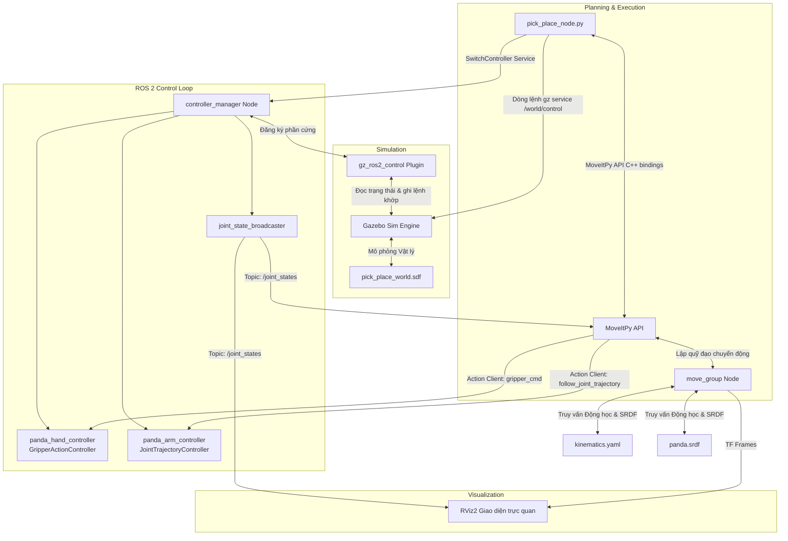

# Tổng hợp Tài liệu Workspace: Hệ thống Lập kế hoạch và Mô phỏng Gắp thả Cánh tay Robot Panda (MoveIt 2 & Gazebo Sim)

Tài liệu này cung cấp một cái nhìn tổng quan toàn diện, phân tích chi tiết cấu trúc kiến trúc phần mềm, tổng hợp tất cả các hàm và cơ chế hoạt động của toàn bộ 5 gói phần mềm ROS 2 điều khiển cánh tay robot Panda thực hiện chuỗi kịch bản gắp thả tự động.

---

## 1. Tổng quan Kiến trúc Hệ thống và Luồng Dữ liệu

Workspace này bao gồm 5 gói phần mềm ROS 2 tương tác chặt chẽ với nhau:
1. **`my_robot_arm_description`**: Cung cấp mô hình vật lý robot (URDF/Xacro) và giao diện phần cứng cho ros2_control.
2. **`my_robot_arm_control`**: Cấu hình và chạy trình quản lý bộ điều khiển (`controller_manager`) để điều khiển cánh tay robot và bộ kẹp.
3. **`my_robot_arm_gazebo`**: Khởi chạy môi trường giả lập vật lý Gazebo thế giới ảo chứa bàn làm việc và vật gắp.
4. **`my_robot_arm_moveit_config`**: Cấu hình lập kế hoạch quỹ đạo MoveIt 2 (tránh va chạm, động học ngược).
5. **`my_robot_arm_pick_place`**: Chứa Node logic điều khiển chính điều hành toàn bộ quy trình gắp thả tự động.

### Sơ đồ tương tác hệ thống (Mermaid)

---

## 2. Tổng hợp các Hàm Sử dụng trong Workspace

Dưới đây là bảng tổng hợp tất cả các hàm chức năng được triển khai trong mã nguồn Python (bao gồm Node logic và các tệp khởi chạy Launch của ROS 2).

| Tên Hàm / Phương thức | Nằm trong Tệp tin | Tham số | Kiểu trả về | Giải thích chi tiết |
| :--- | :--- | :--- | :---: | :--- |
| **`__init__(self)`** | [pick_place_node.py](file:///e:/Robotics/arm_robot/src/my_robot_arm_pick_place/my_robot_arm_pick_place/pick_place_node.py) | Không | Không | Hàm dựng khởi tạo Node ROS 2, đọc parameters cấu hình gắp thả, cấu hình động MoveIt thông qua `MoveItConfigsBuilder`, khởi tạo đối tượng `MoveItPy` điều khiển khớp, và kích hoạt luồng chạy nền kịch bản. |
| **`move_arm_to_named_state(self, state_name)`** | [pick_place_node.py](file:///e:/Robotics/arm_robot/src/my_robot_arm_pick_place/my_robot_arm_pick_place/pick_place_node.py) | `state_name` (str): Tên tư thế đặt trước trong SRDF | `bool` | Đưa cánh tay robot di chuyển đến tư thế khớp được đặt tên sẵn (ví dụ: `'ready'`). Thực hiện lập kế hoạch quỹ đạo qua OMPL và truyền tải lệnh thực thi đến `/panda_arm_controller`. Cho phép thử lại tối đa 3 lần. |
| **`move_arm_to_pose(self, x, y, z, ox, oy, oz, ow, label)`** | [pick_place_node.py](file:///e:/Robotics/arm_robot/src/my_robot_arm_pick_place/my_robot_arm_pick_place/pick_place_node.py) | `x, y, z` (float): Tọa độ đích Cartesian `ox, oy, oz, ow` (float): Hướng Quaternion của điểm cuối `label` (str): Nhãn để in log ghi nhận | `bool` | Thiết lập mục tiêu vị trí 3D cho khâu cuối cánh tay (`panda_link8`) so với đế robot (`panda_link0`), gọi dịch vụ lập đường đi tránh va chạm của MoveIt và gửi lệnh chuyển động. Thử lại tối đa 3 lần. |
| **`set_gripper(self, state_name)`** | [pick_place_node.py](file:///e:/Robotics/arm_robot/src/my_robot_arm_pick_place/my_robot_arm_pick_place/pick_place_node.py) | `state_name` (str): Trạng thái kẹp (`'open'` hoặc `'close'`) | `bool` | Kích hoạt bộ kẹp đóng lại hoặc mở ra bằng cách lập kế hoạch di chuyển góc khớp của gripper đến cấu hình khớp ngón kẹp chỉ định sẵn, thực thi qua `/panda_hand_controller`. Thử lại tối đa 3 lần. |
| **`reset_world(self)`** | [pick_place_node.py](file:///e:/Robotics/arm_robot/src/my_robot_arm_pick_place/my_robot_arm_pick_place/pick_place_node.py) | Không | Không | Thực thi lệnh gọi dịch vụ Gazebo thông qua tiến trình dòng lệnh con (`subprocess`) để reset lại tư thế tĩnh của các vật thể giả lập trong Gazebo Sim và đặt lại tọa độ của vật gắp `pick_object` về đúng vị trí ban đầu $(0.5, 0.0, 0.445)$. |
| **`reactivate_controllers(self)`** | [pick_place_node.py](file:///e:/Robotics/arm_robot/src/my_robot_arm_pick_place/my_robot_arm_pick_place/pick_place_node.py) | Không | Không | Tạo một Client bất đồng bộ gọi dịch vụ `/controller_manager/switch_controller` để kích hoạt lại các bộ điều khiển ROS 2 Control bị dừng do ảnh hưởng từ lệnh reset thế giới mô phỏng Gazebo. |
| **`run_pick_and_place(self)`** | [pick_place_node.py](file:///e:/Robotics/arm_robot/src/my_robot_arm_pick_place/my_robot_arm_pick_place/pick_place_node.py) | Không | Không | Vòng lặp tuần tuần tự chính của Node. Gọi hàm thực thi chuỗi kịch bản gắp thả, tiến hành reset thế giới mô phỏng Gazebo, khôi phục bộ điều khiển và lặp lại chu kỳ sau mỗi 2 giây. |
| **`execute_sequence(self)`** | [pick_place_node.py](file:///e:/Robotics/arm_robot/src/my_robot_arm_pick_place/my_robot_arm_pick_place/pick_place_node.py) | Không | `bool` | Thực thi tuần tự chuỗi 11 bước chuyển động Cartesian và hoạt động kẹp nhả vật thể. Trả về `True` nếu hoàn thành toàn bộ chuỗi chuyển động, ngược lại trả về `False` để báo lỗi. |
| **`main(args)`** | [pick_place_node.py](file:///e:/Robotics/arm_robot/src/my_robot_arm_pick_place/my_robot_arm_pick_place/pick_place_node.py) | `args` (list): Tham số đầu vào dòng lệnh | Không | Khởi tạo thư viện `rclpy`, tạo thực thể Node `PickPlaceNode`, bắt đầu chạy vòng lặp xử lý sự kiện ROS 2 spin, và dọn dẹp bộ nhớ khi tắt tiến trình. |
| **`load_yaml(package_name, file_path)`** | File Launch ở các gói | `package_name` (str): Tên gói chứa file `file_path` (str): Đường dẫn nội bộ của file YAML | `dict` | Hàm bổ trợ dùng để tìm đường dẫn thư mục cài đặt của gói ROS 2, đọc và phân tích cấu trúc dữ liệu tệp YAML phục vụ cho cấu hình node Launch. |
| **`generate_launch_description()`** | Tệp tin `*.launch.py` trong 5 gói | Không | `LaunchDescription` | Điểm vào (entry point) bắt buộc của các tệp Launch ROS 2, định nghĩa các đối số (arguments), khai báo các Node khởi chạy, thiết lập bộ xử lý sự kiện tuần tự và trả về đối tượng `LaunchDescription` cho công cụ khởi chạy của ROS 2. |

---

## 3. Giải thích Kỹ thuật Chi tiết các Hàm và Cơ chế Hoạt động

### 3.1. Giao tiếp Lập kế hoạch bằng API Python `MoveItPy`
Khác với các ứng dụng ROS cũ sử dụng thư viện `moveit_commander` giao tiếp qua các kênh trung gian, Node [pick_place_node.py](file:///e:/Robotics/arm_robot/src/my_robot_arm_pick_place/my_robot_arm_pick_place/pick_place_node.py) sử dụng trực tiếp **`MoveItPy`**. 
- Thư viện này là bindings Python trực tiếp của mã nguồn C++ MoveIt 2. Nó nạp toàn bộ cấu hình robot ngay bên trong bộ nhớ của Node hiện tại, giúp lập kế hoạch chuyển động động và truy cập trực tiếp vào các đối tượng biểu diễn trạng thái robot (`RobotState`), cấu trúc mô hình (`RobotModel`) mà không bị trễ mạng qua ROS Topics/Services.
- **Tại sao cần tạo Luồng nền (`threading.Thread`)?**
  Khi chạy một node ROS 2, luồng chính cần liên tục quay vòng (`rclpy.spin(node)`) để xử lý các yêu cầu Callback đến từ các topic (ví dụ: dữ liệu `/clock` từ mô phỏng, trạng thái khớp `/joint_states`). Kịch bản gắp thả là một chuỗi hành động chặn (blocking) tuần tự sử dụng nhiều hàm `time.sleep()`. Nếu chạy trực tiếp trên luồng chính, node sẽ bị block hoàn toàn, không thể cập nhật trạng thái robot mới và dẫn đến lỗi lập kế hoạch chuyển động. Do đó, việc tách kịch bản gắp thả sang luồng phụ chạy song song là bắt buộc.

---

### 3.2. Chuỗi kịch bản Gắp và Thả tuần tự 11 bước (`execute_sequence`)

Hàm [execute_sequence](file:///e:/Robotics/arm_robot/src/my_robot_arm_pick_place/my_robot_arm_pick_place/pick_place_node.py#L310) thực hiện chuỗi kịch bản điều khiển Cartesian chính xác thông qua các bước phối hợp cánh tay và gripper:

1. **Chuẩn bị và mở kẹp (Bước 1 & 2)**:
   Robot thu cánh tay về góc khớp an toàn đã định nghĩa trước (`ready`) để tránh va chạm với chướng ngại vật ngẫu nhiên trên bàn, sau đó ra lệnh mở rộng kẹp tối đa (`open`) tương đương độ mở ngón là **0.035 m** mỗi ngón.
2. **Tiếp cận vị trí gắp (Bước 3 & 4)**:
   Tọa độ vật gắp nằm ở $(0.5, 0.0, 0.445)$. Robot di chuyển Cartesian đến điểm tiếp cận nằm thẳng đứng phía trên vật gắp ở độ cao $z = 0.445 + 0.12 = 0.565$ m (pre-grasp). Khi đã định vị an toàn, robot hạ thẳng đứng theo trục Z xuống độ cao khớp gắp $z = 0.445$ m (grasp). Việc chia nhỏ thành 2 giai đoạn (tiếp cận -> hạ thẳng xuống) giúp tránh việc ngón kẹp va đập ngang làm lệch vị trí vật.
3. **Gắp và nâng vật (Bước 5 & 6)**:
   Kích hoạt bộ kẹp chuyển về trạng thái `'close'` (khoảng cách ngón $0.018$ m để kẹp chặt khối hộp $4$ cm). Sau khi kẹp đóng hoàn tất, cánh tay nhấc thẳng đứng lên độ cao rút lui $z = 0.445 + 0.20 = 0.645$ m (post-grasp retreat) để nâng vật lên khỏi mặt bàn.
4. **Di chuyển và đặt vật (Bước 7 & 8)**:
   Cánh tay mang theo vật thể di chuyển trên không đến điểm tiếp cận an toàn phía trên tọa độ đặt vật $(0.5, 0.3, 0.445 + 0.15 = 0.595)$ m (pre-place). Sau đó, cánh tay nhẹ nhàng hạ thẳng đứng xuống độ cao đặt vật $z = 0.445$ m (place).
5. **Giải phóng vật thể và thu hồi (Bước 9, 10 & 11)**:
   Mở kẹp giải phóng vật thể (`open`), nhấc cánh tay lên cao an toàn $z = 0.445 + 0.20 = 0.645$ m để tránh va chạm khi rút lui, và cuối cùng thu cánh tay robot trở lại tư thế ready.

---

### 3.3. Tương tác reset thế giới giả lập (`reset_world`)
Để hệ thống có thể hoạt động lặp đi lặp lại vô hạn tự động, sau mỗi chu kỳ, mô phỏng cần được đưa về trạng thái gốc. Hàm `reset_world` gọi trực tiếp công cụ CLI của Gazebo Sim:
- **`reset: {model_only: true}`**: Lệnh này chỉ đặt lại vị trí hình học của các mô hình trong không gian mô phỏng về gốc tọa độ ban đầu mà không reset lại thời gian chạy mô phỏng. Việc không reset thời gian mô phỏng giúp tránh làm gián đoạn dòng đồng hồ `/clock` gửi về ROS 2, từ đó không làm treo hoặc crash các node điều khiển.
- **Định vị lại khối vật gắp**: Khi robot đặt vật gắp xuống vị trí đặt (place), khối hộp đã di chuyển tới $(0.5, 0.3)$. Lệnh gọi dịch vụ thiết lập tư thế của Gazebo sẽ định vị lại khối hộp đỏ chính xác về tọa độ gắp $(0.5, 0.0, 0.445)$ để sẵn sàng cho chu kỳ gắp thả tiếp theo.

---

### 3.4. Khôi phục trạng thái bộ điều khiển bất đồng bộ (`reactivate_controllers`)
> [!WARNING]
> Khi gọi lệnh reset mô hình của Gazebo Sim, trình quản lý phần cứng `gz_ros2_control` sẽ giải phóng các khớp và đưa trạng thái các bộ điều khiển khớp ROS 2 Control hiện tại về trạng thái `inactive` (không hoạt động).

Để hệ thống điều khiển tiếp tục nhận lệnh, Node Pick & Place cần tự động khôi phục lại các controller thông qua mã Python:
1. Tạo kết nối Client đến dịch vụ điều phối của ROS 2: `/controller_manager/switch_controller`.
2. Tạo yêu cầu `SwitchController.Request()` khai báo danh sách các bộ điều khiển cần kích hoạt lại: `['joint_state_broadcaster', 'panda_arm_controller', 'panda_hand_controller']`.
3. Cấu hình cờ `activate_asap = True` và mức độ nghiêm ngặt là `BEST_EFFORT` để bộ quản lý tự động bật lại các controller ngay khi giao diện phần cứng Gazebo khởi tạo xong.
4. Sử dụng cơ chế gọi dịch vụ bất đồng bộ `call_async()` kết hợp kiểm tra trạng thái tương lai (`future.done()`) trong vòng lặp thời gian chờ tối đa 5.0 giây nhằm tránh việc block tiến trình Node.

---

### 3.5. Cơ chế Điều phối Tiến trình Tuần tự trong Launch Files
Trong ROS 2, các node khởi chạy đồng thời và không đảm bảo thứ tự sẵn sàng hoạt động. Để xây dựng hệ thống điều khiển tin cậy, các file launch sử dụng các kỹ thuật phối hợp nâng cao:
- **`TimerAction`**: Dùng để trì hoãn việc kích hoạt một hành động theo thời gian cố định. Ví dụ, trong [gazebo.launch.py](file:///e:/Robotics/arm_robot/src/my_robot_arm_gazebo/launch/gazebo.launch.py), việc spawn `joint_state_broadcaster` được trì hoãn 5.0 giây để chắc chắn Gazebo Sim đã nạp xong và mở cổng dịch vụ bộ quản lý điều khiển.
- **`RegisterEventHandler` kết hợp `OnProcessExit`**:
  Cơ chế bắt sự kiện động.
  - Bộ điều khiển cánh tay `panda_arm_controller` chỉ được spawn khi tiến trình spawn bộ điều khiển trạng thái khớp `joint_state_broadcaster` đã hoàn tất thành công và thoát ra (`OnProcessExit`).
  - Bộ điều khiển kẹp `panda_hand_controller` tiếp tục chờ tín hiệu hoàn thành của `panda_arm_controller`.
  Thiết kế tuần tự này triệt tiêu hoàn toàn lỗi xung đột ghi bộ nhớ khớp của `controller_manager` khi nhiều bộ điều khiển cố gắng tự đăng ký quyền điều khiển phần cứng cùng một lúc.
